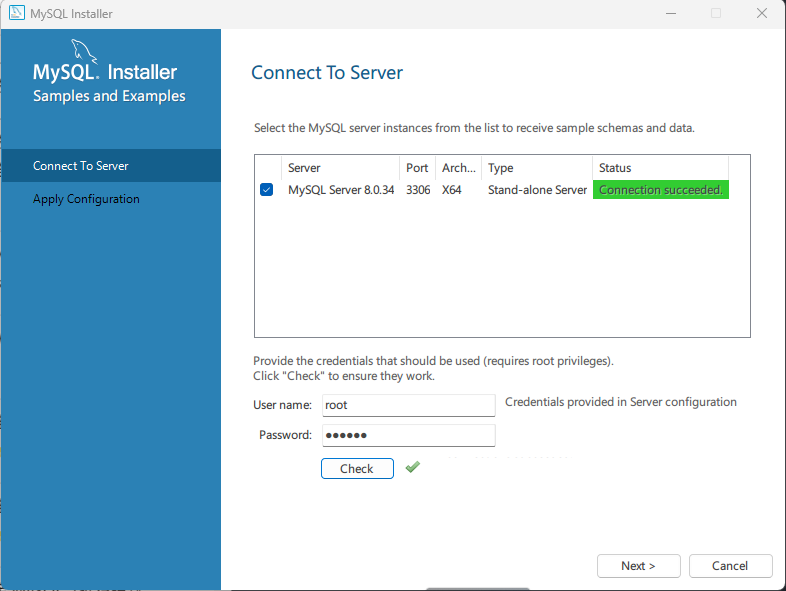
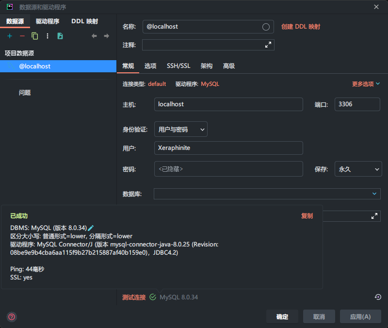
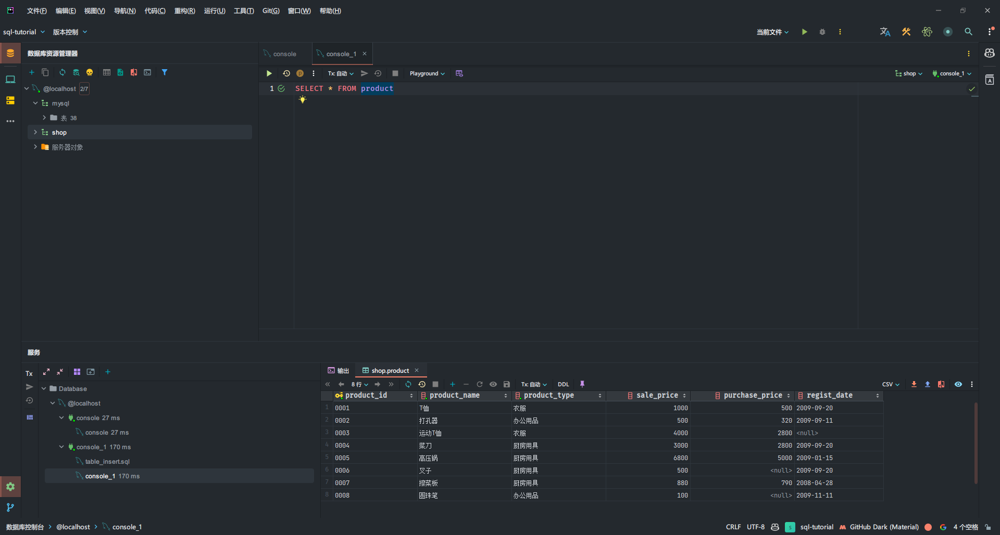

考虑到用 JetBrains 家的东西已经比较熟手了，因此本次 Wonderful SQL 的学习笔记将以 JetBrains DataGrip with MySQL 的配置为主。安装 MySQL 的过程在 🐋DataWhale 的教程中已经相当详细了，因此这里也不多做赘述。

## 安装 Logs





## 测试一下

```SQL
SELECT * FROM product
```




## SQL 待读书籍

- [ ] [SQL 必知必会](https://book.douban.com/subject/24250054/)
- [ ] [SQL 基础教程]()
- [ ] [SQL 进阶教程]()

## 数据库理论相关待读

- [ ] [Database System Concepts, 7th ed.]()

## 参考资料
